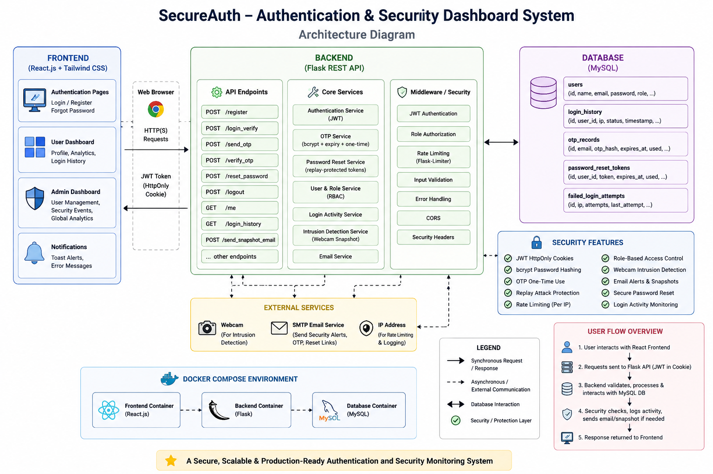
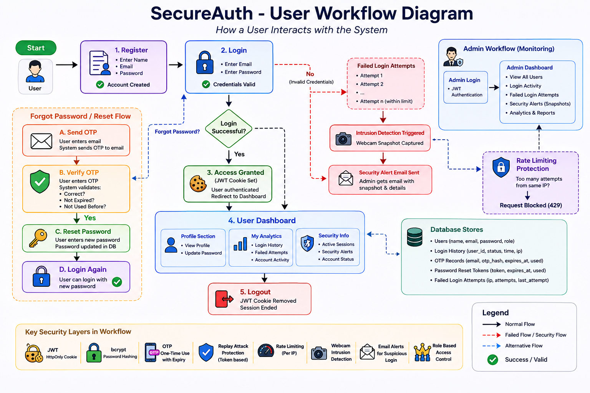
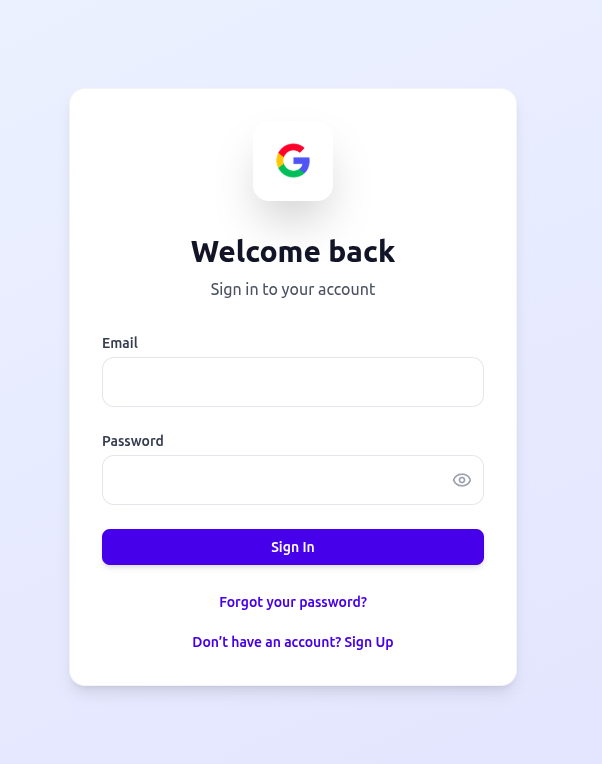
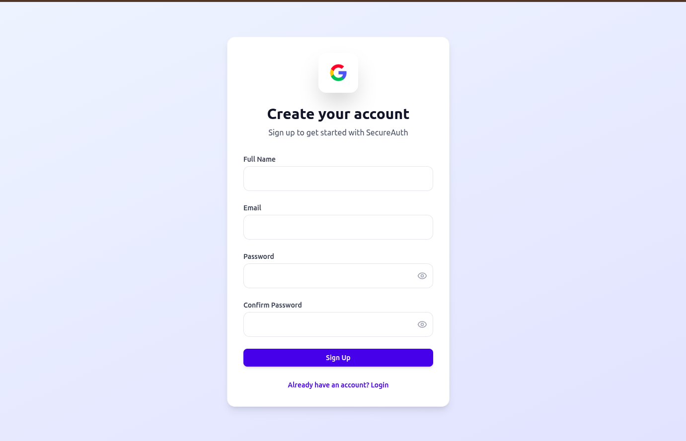
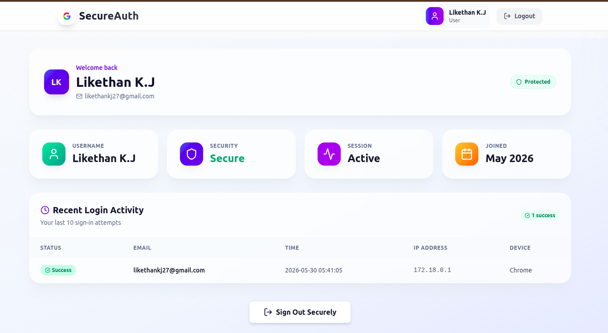
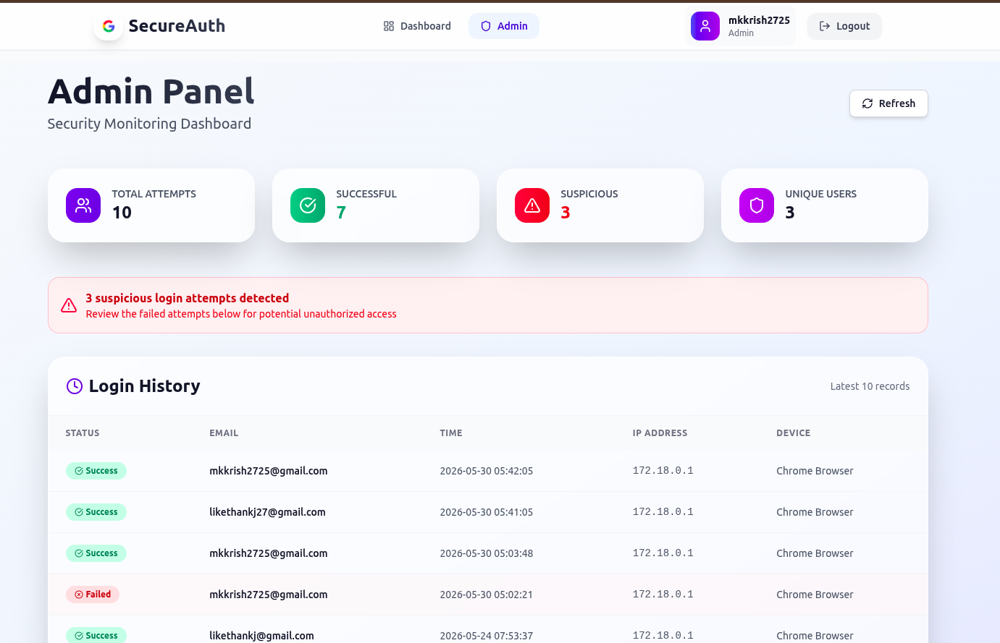
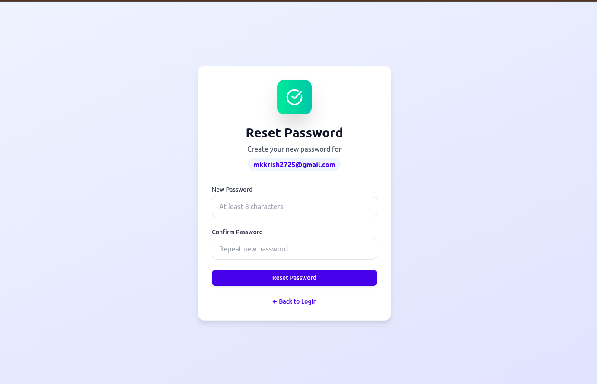

# SecureAuth 🔐

A production-ready security-focused authentication platform built using React, Flask, MySQL, and Docker.

SecureAuth combines modern authentication mechanisms with real-time security monitoring features such as webcam-based intrusion detection, OTP password recovery, role-based access control, login analytics, and rate limiting.

## 🚀 Features

### Authentication & Authorization

* JWT Cookie Authentication
* Secure User Registration
* User Login & Logout
* Session Persistence
* Protected Routes
* Role-Based Access Control (User/Admin)

### Password Recovery

* OTP-Based Password Reset
* OTP Expiry Validation
* One-Time OTP Usage
* Replay-Protected Reset Tokens
* Secure Password Update Workflow

### Security Features

* bcrypt Password Hashing
* Webcam Intrusion Detection
* Failed Login Snapshot Capture
* Security Alert Emails
* Login Activity Monitoring
* Rate Limiting Protection
* Admin Authorization Controls

### Dashboard & Analytics

* User Dashboard
* Admin Dashboard
* Login History Tracking
* User Activity Monitoring
* Security Status Monitoring

### DevOps & Deployment

* Dockerized Architecture
* Docker Compose Support
* Environment Variable Management
* Production-Ready Configuration

---

## 🛠 Tech Stack

### Frontend

* React.js
* Vite
* Tailwind CSS
* React Router
* Axios
* React Hook Form
* Yup Validation

### Backend

* Flask
* JWT
* Flask-Limiter
* bcrypt
* Gmail SMTP

### Database

* MySQL

### DevOps

* Docker
* Docker Compose
* Git
* GitHub

---

## 🏗 Architecture Diagram

<h2 align="center">🏗 Architecture Diagram</h2>

<p align="center">
  
</p>

---

## 👤 User Workflow Diagram

<h2 align="center">👤 User Workflow Diagram</h2>

<p align="center">
  
</p>

---

## 🔒 Security Architecture

### Authentication Flow

1. User Login
2. JWT Cookie Issued
3. Protected Route Validation
4. Session Verification via /me

### Password Recovery Flow

1. User Requests OTP
2. OTP Sent via Email
3. OTP Verification
4. One-Time Reset Token Generated
5. Password Reset Authorized
6. Reset Token Invalidated

### Intrusion Detection Flow

1. Failed Login Attempt
2. Webcam Snapshot Captured
3. Security Alert Email Sent
4. Admin Monitoring Dashboard Updated

---

## 📡 API Endpoints

| Method | Endpoint             | Description             |
| ------ | -------------------- | ----------------------- |
| POST   | /register            | Register User           |
| POST   | /login_verify        | User Login              |
| GET    | /me                  | Session Validation      |
| POST   | /logout              | Logout User             |
| POST   | /send_otp            | Send Password Reset OTP |
| POST   | /verify_otp          | Verify OTP              |
| POST   | /reset_password      | Reset Password          |
| POST   | /send_snapshot_email | Security Alert Email    |
| GET    | /login_history       | Login History           |

---

## 🐳 Docker Setup

### Start Application

```bash
docker compose up --build
```

### Services

* Frontend → http://localhost:3000
* Backend → http://localhost:5000
* MySQL → localhost:3307

---

## 📸 Screenshots

<h3>🔐 Login Page</h3>

<p align="center">
  
</p>
<h3> Signup page</h3>
<p align="center">
   
   </p>

<h3>👤 User Dashboard</h3>

<p align="center">
  
</p>

<h3>🛡️ Admin Dashboard</h3>

<p align="center">
  
</p>

<h3>🔑 Password Recovery</h3>

<p align="center">
  
</p>


## 🔮 Future Enhancements

* OAuth Login (Google/GitHub)
* Two-Factor Authentication (2FA)
* Device Fingerprinting
* Security Audit Logs
* CI/CD Pipeline
* Cloud Deployment

---

## 👨‍💻 Author

Manojkrishna M

B.Tech Artificial Intelligence & Data Science

---

⭐ If you found this project useful, consider starring the repository.
